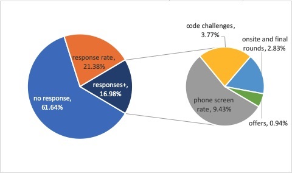
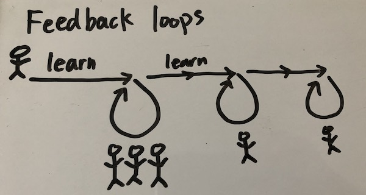

# Reflections on the journey so far

(with respect to changing careers to be a software developer)

1. [The Past](#past)
2. [Thoughts and Learnings](#learnings)
3. [Today](#today)

## The Past

Four years ago, to the day on the 29th (thanks, leap year), I started a list I titled "The non-judgemental, everything but the kitchen sink Things I want to do/accomplish list (or try)". Yes, judgmental was misspelled. 🤷🏻‍♀️ Among the top of the list was to "Not be afraid to quit my job, change career paths ~~if/when I'm confident in my skills~~". Not sure when the strikethrough was added, but it probably came after some realization that I'll never feel "ready enough" for most anything.

Around this time, I'd been taking community college classes at night to learn programming more seriously for about 2 years, but realized they 1. weren't that challenging (compared to the other engineering classes I'd taken in university) and 2. I couldn't see how those intro classes with different languages could help me land a job anytime soon. I felt like we barely scratched the surface.

I started learning some JavaScript July/August 2016 after gathering advice from software developers I knew.

> You should gamble on yourself. - My sibling

I gave my boss notice that I was planning on leaving in October that year, but I didn't leave until January 2017 so I could continue to save up money while studying and plan my next steps. I told myself I'd give it a year to make the career transition.

December 2016. I didn't pass the admissions interview for a coding school. Between my skeptism of code bootcamps' outcomes and my own frustration of the actual interview where I didn't realize I was being recorded until partway through my bumbling attempts to code/fix the problems, I told myself I was going the self-study route. The skeptism came from reading articles like "Want a Job in Silicon Valley? Keep Away From Coding Schools". I've been seeing more of these types of articles lately, due to their continued growth.

February 2017. Learning/coding and following tutorials by myself until 3am and waking up at noon became the norm. This was definitely not sustainable and I didn't think I was making the progress at the level/pace I wanted. I knew there were tons of free resources on the Internet, so why should I pay to learn? As a fumbled between these thoughts, I began looking into code bootcamps again.

March 2017. Decided to go to a coding bootcamp and was accepted into a program that started in April.

April - July 2017. Attending bootcamp. My friends let me stay at their home during this time, saving me from a long daily commute. Review I did of the coding bootcamp I attended [here](https://www.coursereport.com/schools/rithm-school?shared_review=14160#/reviews/review/14160). I still stand by most of my statements. However, "trust the process" should have been reserved for when I reference and cheer on the Sixers and nothing else. It also is tone-deaf in light of some recent usage. In the case now writing this, and when I made the review, these are both looks backward. When you're in the moment and learning, you don't have the mindset to look at where you are/how much you've learned in such a short period of time. You are overwhelmed, regardless of where you're attending. I think I'd say "trust the people" instead at this point. People create these processes. You can tell when people are genuine, have experience, and know how to teach. You can tell when people want you to succeed because they'll back it up with action to support you as someone with less experience or when people are mailing it in because they get paid regardless. I constantly had to remind myself that learning is not a competition with those in my cohort, but that I need to know myself well enough to give myself the time and space to learn, whether or not that fits into the time frame of the class, because the learning never stops. I'd try to retain key lesson objectives and knew that I'd come back for the rest if was important enough.

August 2017. Coding interview prep program. Started learning how to play the interview game (maybe thoughts on that at a later time). Started applying to jobs. Still didn't feel ready.

September 2018. Started learning and working with the GarageScript community I met through a meetup. Learning from others with more and less experience gave me a better understanding of software development in teams and the importance of communication. It also showed me different perspectives on how to approach problems. I think this time of learning was just as good as the time at the coding bootcamp; I was spending most of my time there until I got offers.

December 2017 - February 2018. One year mark after quitting my job. I took most of this time off from applying to jobs to try to enjoy the holidays, re-evaluate, and focus on learning without the context switching needed to interview, study, and work on projects at the same time.

April/May 2018. 3 offers for contracted software developer roles at large companies.

|                                                      | Time it took to get a job |
| ---------------------------------------------------- | ------------------------: |
| From when I built my first Geocities page [*]        |                 ~16 years |
| From when I started learning JavaScript seriously    |                 23 months |
| From when I started the coding bootcamp              |                 13 months |
| From when the coding bootcamp ended to getting a job |                 10 months |

[*] blink and marquee tags were probably used, as well as flaming text gifs. I regret nothing.

My response rate primarily in the Bay Area, out of 300+ opportunities from August 2017 - May 2018:

## Thoughts and Learnings

It would be remiss of me if I didn't reiterate how fortunate I was to have the resources and support to change careers.

A partial list of things that helped my chances:

- Having supportive family and friends
- Having a network with at least a few software engineers/people I can ask for advice from
  - Seeing others who have done well after going to a coding bootcamp
- Having a college degree (BS Engineering)
- Capital to pay for more education/training
  - Not having to context switch between holding a part-time/full-time job and coding
  - Not having debt
- Not having to worry about housing and other essentials
- Not having dependents

These things, among others, may detract many great people from choosing development as a path, because they simply don't have the resources (time, energy, money), and where scholarships to learn would help.

This got me thinking about risk management and the cost of education a little bit. Here's a rough model of what I'm thinking:

### Level of Risk vs. Cost of education

|           | Low Risk (job guarantee)  | High Risk (no guarantee)         |
| --------- | ------------------------- | -------------------------------- |
| Low Cost  | No Brainer                | Will I invest enough time/energy |
| High Cost | Guaranteed if you have \$ | Shot in the Dark                 |

**Low level Risk & Low Opportunity Cost**

No Brainer - Why would anyone NOT choose to do this?
ex. Bootcamp/school is free/minimal for the student (or pays you to learn-- one can dream; this is NOT a pay-later model) and guarantees a job afterwards. It might fit around your schedule, and is probably going to take you a while to learn. Rigid contract/hoops to jump through for the guarantee. I don't think this exists at scale (if it does exist, it only supports a select, lucky few). This could be like a job training program or apprenticeship powered by devs/instructors with a company's support.

**Low level Risk & High Opportunity Cost**

Guaranteed if you have the money - if you have the money now and you can jump through the hoops, you're set
ex. Bootcamp costs a lot, but guarantees a job afterwards. Demands most of your day, but it's a rigid contract due to the guarantee.
An idealized example could be like having a private tutor who is a seasoned developer teach you all you need to know until they think you're ready and they have a ton of connections to be able to set you up with interviews to get a job.

**High level Risk & Low Opportunity Cost**

Will I spend enough time/energy - given an ample amount of time and if I work at it, I can eventually get there while still paying my bills
ex. Bootcamp doesn't guarantee a job but it's free/easily within your means. Possible flexible schedule/part-time, it's probably going to take you a while. Or you're self-teaching. Not knowing what to study/what to focus on is probably in this category.

**High level Risk & High Opportunity Cost**

Shot in the dark - leaving it to chance with no fallback plan - both your time and money resources are gone.
ex. Bootcamp costs a lot, and doesn't guarantee a job afterwards. I'd argue that a pay later with a percentage of your income model falls in the high risk, high cost category, just like another other schooling where you would accumulate debt.

I think most bootcamps are in the high risk, high cost quadrant on the lower right. Most are risky, just like colleges these days. The self-study route fits into the high risk, low cost category. I think self-study is great if you can do it, and it is needed to a certain extent to propel you to the point of figuring out if programming is a good fit for you. Like most things, you don't know if you're good at something until you try it, not just in theory, but when you put it in practice.

Going back to my own indecisiveness on whether or not to go to a code school versus self-study, the piece that I was missing through my self-study time was seeking feedback from others. The prideful part of me thought I could pull myself up by my bootstraps and do it all on my own. I had believed that coding was solely a solitary job that would be great for my introvertedness. I am glad I was wrong about the solitary aspect.

### Feedback Loops

The piece I was missing about learning was the need to get feedback to improve. Asking a teacher or mentor for help accelerates your learning and understanding. By shortening the time to the next feedback, you don't rabbit hole as much on something you may be struggling with. This is not to say struggling isn't good; struggling is necessary, but you also need to know when to ask for help. I would timebox myself on if I couldn't figure a problem out, I'd seek help after the next hour or day, depending on the level of complexity. I would give myself many more days for concepts so that I could read and re-read, watch videos or whatever else I could gather to understand and let those ideas marinate.

By having continual feedback, you begin to build your own sense of course correction by knowing yourself and your learning styles better, and you won't need to ask for feedback on as many things like you used to because you may be starting to think like your teachers/mentors when they explain their thought processes. In my experience, I felt like as I learned more, even the questions I asked were better and not things that I could have easily grasped even if I had read more texts. I had learned how to break down problems into smaller, more manageable chunks and solve those subproblems first.

## Today

So why am I writing about this experience, years after? One of the things on my list I added later was "Leverage my knowledge and skills in programming (or lack thereof) to help others." A part of another list item mentioned "I don't write near enough what I think/feel". To me, it has been and continues to be incredibly rewarding to see people progress and work hard to achieve their goals. If I can do something to help be a part of that, great.
